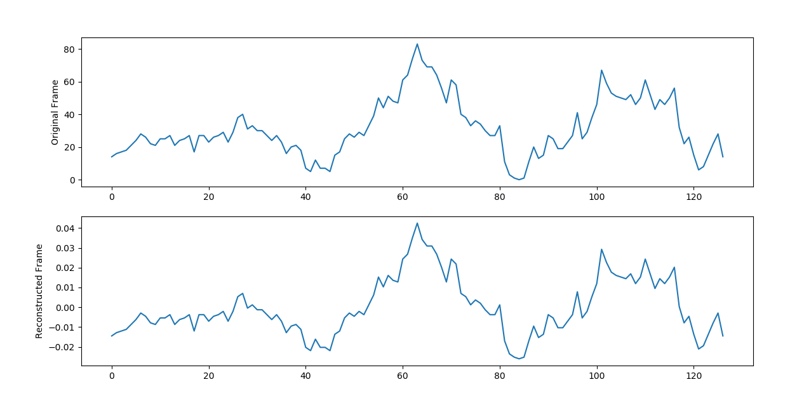
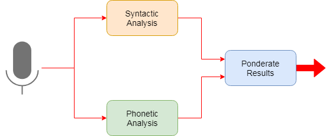

# Aula de Emprendimiento

Proyecto de Juan Manuel Sánchez Mateo

## Premisa

El objetivo del proyecto es realizar un análisis de sentimientos de la voz humana desde una perspectiva exclusivamente fonética, con el objetivo de clasificarlos en cuatro categorías: happy (alegre), sad (triste), angry (enfadado) y neutral.

## Planteamiento

Para lograr el objetivo expuesto previamente, empleamos las muestras de audio de un estudio del departamento de Psicología de la universidad de Toronto (https://tspace.library.utoronto.ca/handle/1807/24487). Dado que los audios de muestra se corresponden con voz humana, sabemos que constan de una serie de fonemas, la unidad mínima del lenguaje que se corresponde aproximadamente al sonido de una única letra. Además cada uno de estos fonemas se puede representar como una serie de componentes frecuenciales (generalmente entre 1 y 4 kHz).

Utilizando el script get_max_audio_length.py, determinamos que la frecuencia de muestreo es de 24.4 kHz. Dividiendo el audio en tramas de 128 muestras (unos 5 ms)  podemos garantizar que cada trama se corresponde con un único fonema (que probablemente se repita varias veces).

Empleando el script de Python localizado en este repositorio, generate_data_sets.py, dividimos cada fichero de audio en tramas, obtenemos su representación en frecuencias mediante la Transformada Discreta de Fourier (https://en.wikipedia.org/wiki/Discrete_Fourier_transform) y tras una normalización, almacenamos la concatenación de expectros frecuenciales en imágenes del estilo:


En esta imagen cada columna representa el espectro en frecuencias entre 0 y 12.2 kHz de la trama correspondiente, siendo la parte superior de la imagen las frecuencias más bajas, la inferior las más altas y los píxeles más claros cuanto más dominante es la componente frecuencial. Se puede observar que el espectro de las últimas tramas está completamente en negro, esto es porque se corresponden a silencio añadido artificalmente al audio por motivos de normalización.

Esta normalización es necesaria para obtener imágenes de tamaño fijo, y se podría haber realizado de dos formas: añadiendo un silencio al final del audio o extendiendo su duración sin modificar la frecuencia del mismo (duplicando tramas tramas). Se optó por la primera opción porque parecía asemejarse más a un caso real en el que era posible que se dieran silencios dentro del audio. De manera similar también se ha normalizado la amplitud del espectro para que el máximo (un píxel blanco) se corresponda con el componente frecuencial de mayor intensidad dentro de cada trama, pero independiente del volumen del audio original (y de otras tramas). Finalmente, hemos eliminado la componente de 0 Hz (que se corresponde con la posición 0 del resultado numpy.fft https://docs.scipy.org/doc/numpy-1.13.0/reference/routines.fft.html#module-numpy.fft) porque representa nada más que un offset provocado por el formato del audio. Estos dos últimos cambios provocan cambios significativos, pero como se puede ver en la imagen siguiente la forma de onda se mantiene aunque la amplitud y el offset cambien.



Una vez obtenidas todas las imágenes, el objetivo se convierte en un problema de clasificación de imágenes mediante Keras y Tensorflow como el descrito en https://www.tensorflow.org/tutorials/keras/basic_classification .

## Resultados

Empleamos 1500 de las imágenes previamente generadas (375 de cada sentimiento) para entrenar el modelo.

Las 98 imágenes restantes que no hemos empleado en el entrenamiento nos sirven para comprobar el correcto funcionamiento del modelo.

Finalmente podemos analizar ficheros de audio .wav utilizando el script analyze_audio_file.py especificando el fichero de audio:
```
python analyze_audio_file.py audio_example.wav
```

Este script adpatará la fecuencia de muestreo para que coincida con nuestros 24.4 kHz, dividirá el audio en bloques de 72960 muestras (para obtener 570 tramas de 128 muestras, se añadirá silencio al final de ser necesario), y aplicará el modelo de clasificación a cada bloque para devolver la media de las probabilidades de cada sentimiento.


## Conclusiones

## Posibles mejoras

Las muestras empleadas son de corta duración y representan un único sentimiento, pero provienen de tan sólo dos personas, los "sentimientos" no son naturales sino actuados y todos los audios son de la forma "Say the word [...]" con un silencio artificial de duración variable al final. El primer punto a mejorar del sistema sería entrenar al modelo con audios se correspondieran realmente con lo que se pretende clasificar.

Es posible que el tamaño de trama sea demasiado pequeño teniendo en cuenta la frecuencia de muestreo, y que se pierda parte del periodo de un fonema entre varias tramas. Un análisis del resultado del entrenamiento a partir de datasets generados con tramas de diferente tamaño sería una mejora a consiferar de cara al futuro.

La normalización en volumen también ha podido ser perjudicial. Dado que la normalización se ha realizado por trama, no se están teniendo en cuenta posibles cambios de volumen dentro del discurso. En un futuro podría aplicarse una normalización uniforme a la totalidad del audio.

De igual modo que se ha suprimido el offset del audio porque no nos aportaba información, sería posible realizar un filtrado en paso banda del audio para quedarse únicamente con las frecuencias que puede emitir una voz humana, eliminando el mayor ruido posible en el proceso.

Un análisis sintáctico complementaría perfectamente al análisis fonético que hemos implementado en el proyecto, permitiendo analizar qué se dice y cómo.Ponderando resultados en función de la fiabilidad de cada análisis deberíamos poder obtener un resultado bastante confiable del sentimiento que transimte una grabación de voz.

