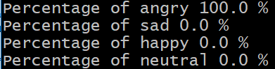

# Aula de Emprendimiento

Proyecto de Juan Manuel Sánchez Mateo

## Introducción

El objetivo del proyecto es realizar un análisis de sentimientos de la voz humana desde una perspectiva exclusivamente fonética, con el objetivo de clasificarlos en cuatro categorías: happy (alegre), sad (triste), angry (enfadado) y neutral.

Para ello, se ha hecho uso de scripts de Python 3 (probados con las versiones 3.6 y 3.7), de la librería deDeep Learning Keras y de TensorFlow como backend. Estos dos últimos se han ejecutado con la configuración por defecto sobre CPU.

El código se encuentra almacenado en la rama master del repositorio https://git.entelgy.com/juan.manuel/aula-emprendimiento. Para evitar el almacenamiento innecesario, los archivos de audio e imágenes generadas a partir de estos no se han incluido pero pueden ser accedidos a través del siguiente enlace de Drive https://drive.google.com/drive/folders/1BsyTxHsA-st_KzPWZcasKM5OHhC42JL2?usp=sharing.

La ejecución de los scripts de Python requerirá el uso de una versión compatible de Python (3.6 ó 3.7) y tener instalados las librerías requeridas. Esto último se puede hacer ejecutando el comando:
```
pip install -r requirements.txt
```

Los diferentes scripts empleados son:
* get_max_audio_length.py: lee los ficheros de audio de la carpeta raw_audio y muestra por pantalla el mayor número de muestras posibles y la frecuencia de muestreo.
* audio_format.py: implementa la clase AudioFormatter que transforma una lista de muestras de audio en una imagen como las empleadas en la clasificación.
* generate_data_sets.py: lee todos los ficheros de audio de la carpeta raw_audio, genera las imágenes correspondientes y las almacena en training_data y test_data.
* train_model.py: entrena el modelo de Keras con las imágenes de training_data y almacena el resultado en fonetic.h5 y fonetic.json.
* test_model.py: comprueba el funcionamiento del modelo ya entrenado y almacenado en fonetic.h5 empleando las imágenes de test_data.
* classify_audio_file.py: recibiendo el path a un fichero de audio, lo fragmenta, lo convierte en imágenes y obtiene la probabilidad de sentimiento de cada imagen. Finalmente realiza el promedio de probabilidades de sentimiento y lo muestra por pantalla.

## Planteamiento

Para lograr el objetivo expuesto previamente, empleamos las muestras de audio de un estudio del departamento de Psicología de la universidad de Toronto (https://tspace.library.utoronto.ca/handle/1807/24487). Dado que los audios de muestra se corresponden con voz humana, sabemos que constan de una serie de fonemas, la unidad mínima del lenguaje que se corresponde aproximadamente al sonido de una única letra. Además cada uno de estos fonemas se puede representar como una serie de componentes frecuenciales (generalmente entre 1 y 4 kHz).

Utilizando el script get_max_audio_length.py, determinamos que la frecuencia de muestreo es de 24.4 kHz. Dividiendo el audio en tramas de 128 muestras (unos 5 ms)  podemos garantizar que cada trama se corresponde con un único fonema (que probablemente se repita varias veces).

Empleando el script de Python localizado en este repositorio, generate_data_sets.py, dividimos cada fichero de audio en tramas, obtenemos su representación en frecuencias mediante la Transformada Discreta de Fourier (https://en.wikipedia.org/wiki/Discrete_Fourier_transform) y tras una normalización, almacenamos la concatenación de espectros frecuenciales en imágenes del estilo:


En esta imagen cada columna representa el espectro en frecuencias entre 0 y 12.2 kHz de la trama correspondiente, siendo la parte superior de la imagen las frecuencias más bajas, la inferior las más altas y los píxeles más claros cuanto más dominante es la componente frecuencial. Se puede observar que el espectro de las últimas tramas está completamente en negro, esto es porque se corresponden a silencio añadido artificialmente al audio por motivos de normalización.

Esta normalización es necesaria para obtener imágenes de tamaño fijo, y se podría haber realizado de dos formas: añadiendo un silencio al final del audio o extendiendo su duración sin modificar la frecuencia del mismo (duplicando tramas tramas). Se optó por la primera opción porque parecía asemejarse más a un caso real en el que era posible que se dieran silencios dentro del audio. De manera similar también se ha normalizado la amplitud del espectro para que el máximo (un píxel blanco) se corresponda con el componente frecuencial de mayor intensidad dentro de cada trama, pero independiente del volumen del audio original (y de otras tramas). Finalmente, hemos eliminado la componente de 0 Hz (que se corresponde con la posición 0 del resultado numpy.fft https://docs.scipy.org/doc/numpy-1.13.0/reference/routines.fft.html#module-numpy.fft) porque representa nada más que un offset provocado por el formato del audio. Estos dos últimos cambios provocan cambios significativos, pero como se puede ver en la imagen siguiente la forma de onda se mantiene aunque la amplitud y el offset cambien.


Una vez obtenidas todas las imágenes, el objetivo se convierte en un problema de clasificación de imágenes mediante Keras y Tensorflow como el descrito en https://www.tensorflow.org/tutorials/keras/basic_classification .

## Resultados

Empleamos 1500 de las imágenes previamente generadas (375 de cada sentimiento) para entrenar el modelo. Ejecutando el script train_model.py generamos el fichero del modelo fonetic.h5, y su json fonetic.json. Lamentablemente esta ejecución indica que el porcentaje de acierto es de tan solo el 25.80%.

Las 98 imágenes restantes que no hemos empleado en el entrenamiento nos sirven para comprobar el correcto funcionamiento del modelo. Utilizando el script test_model.py realizamos dicha comprobación y lamentablemente obtenemos un porcentaje de acierto del 24.89%.

Finalmente podemos analizar ficheros de audio .wav con una frecuencia de muestreo de 24.414 Hz (se puede aplicar con otra frecuencia de muestreo pero los pixeles de las imágenes ya no se corresponderan con las mismas frecuencias que en los espectrogramas empleados para entrenar, es posible utilizar software externo como SoX para modificar la frecuencia de muestreo de un fichero) utilizando el script classify_audio_file.py especificando el fichero de audio:
```
python classify_audio_file.py audio_example.wav
```

Este script dividirá el audio en bloques de 72960 muestras (para obtener 570 tramas de 128 muestras, se añadirá silencio al final de ser necesario), y aplicará el modelo de clasificación a cada bloque para devolver la media de las probabilidades de cada sentimiento. El resultado de nuevo oscila en torno al 25% para cada sentimiento cuando se esperaba una clara dominancia del enfado.


## Conclusiones

El hecho de que la probabilidad de acierto tienda al 25% por opción (particularmente durante el entrenamiento del modelo), nos indica que el sistema no aporta ninguna mejora frente a una suposición completamente aleatoria. Por tanto analizar los pesos que asigna el modelo no nos aporta ninguna información útil.

El principal problema parece ser la gran similitud entre las imágenes de los espectrogramas de los audios en los que no se parece apreciar ningún patrón que relacione la imagen con el sentimiento (sí parece ser posible observar patrones que se repiten en determinados fonemas por ejemplo). Eso implicaría volver al planteamiento mismo del problema, tratar de averiguar cómo se expresan los sentimientos en la voz humana y buscar una nueva vectorización que permita una mejor representación de esta expresión.

## Posibles mejoras

La primera mejora posible sería la utilización de más muestras para el entrenamiento. El ejemplo de clasificación de imágenes emplea 60000 muestras para 10 posibles categorías, es decir 6000 muestras por categoría frente a nuestras 375. Además las muestras empleadas son de corta duración y representan un único sentimiento, pero provienen de tan sólo dos personas, los "sentimientos" no son naturales sino actuados y todos los audios son de la forma "Say the word [...]" con un silencio artificial de duración variable al final. El primer punto a mejorar del sistema sería entrenar al modelo con más audios que se correspondieran realmente con lo que se pretende clasificar.

Es posible que el tamaño de trama sea demasiado pequeño teniendo en cuenta la frecuencia de muestreo, y que se pierda parte del periodo de un fonema entre varias tramas. Un análisis del resultado del entrenamiento a partir de datasets generados con tramas de diferente tamaño sería una mejora a considerar de cara al futuro.

La normalización en volumen también ha podido ser perjudicial. Dado que la normalización se ha realizado por trama, no se están teniendo en cuenta posibles cambios de volumen dentro del discurso. En un futuro podría aplicarse una normalización uniforme a la totalidad del audio.

De igual modo que se ha suprimido el offset del audio porque no nos aportaba información, sería posible realizar un filtrado en paso banda del audio para quedarse únicamente con las frecuencias que puede emitir una voz humana, eliminando el mayor ruido posible en el proceso.

La clasificación de un fichero de audio externo podría mejorarse permitiendo abrir varios formatos de audio (principalmente .mp3) y redimensionando el vector de muestras desde el código. Por desgracia librerías como scipy tardan demasiado en aplicar el interpolado por lo que sería recomendable utilizar software externo más eficiente como SoX.

Un análisis sintáctico complementaría perfectamente al análisis fonético que hemos implementado en el proyecto, permitiendo analizar qué se dice y cómo. Ponderando resultados en función de la fiabilidad de cada análisis deberíamos poder obtener un resultado bastante confiable del sentimiento que transmite una grabación de voz.

